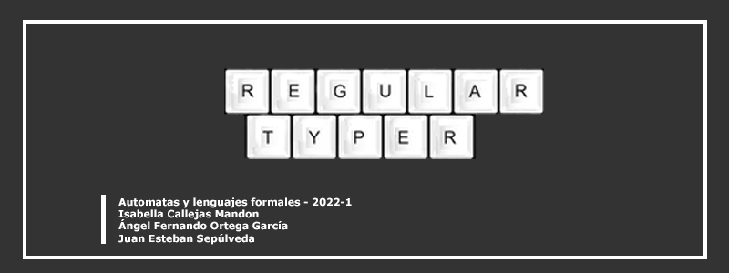

#  { Regular-Typer }

## 🎮 Objetivo:

Desarrollar un juego de typing que implemente una gramática libre de contexto con el fin de generar las palabras para los niveles del mismo.

## 🎮 Resumen:

Un juego de mecanografía (Typing game) es un género de videojuegos que requiere que el jugador escriba de forma rápida o precisa palabras, o letras individuales, números u otras teclas, que se muestran en la pantalla para avanzar en el juego, estas palabras suelen ser generadas por una API o son manualmente almacenadas para luego ser reproducidas en diferente orden para que el usuario las digite, por otro lado, una gramática libre de contexto es capaz de generar infinitas palabras de un lenguaje, por lo que, aprovechando esta propiedad, decidimos crear un juego del tipo typing cuya gramática sea la que genere el contenido de los niveles de nuestro juego, para ello, pretendemos diseñar una gramática libre de contexto basado en inicialmente en el lenguaje que usan muchos juegos de ritmos, flechas (en este caso, izquierda y derecha), y usaremos la librería de Pygame para desarrollar el juego.

### 🎮 Multimedia:
- Video: [Regular-Typer.mp4](https://www.youtube.com/watch?v=37L2AX0tAbA)
- Diapositivas + Guía de uso: [Presentación Regular-Typer](https://github.com/IC-03/Regular-Typer/blob/main/Regular-Typer_Presentaci%C3%B3n.pdf)
- Presentación SystemFest: [SystemFest 2022-I Regular-Typer](https://github.com/IC-03/Regular-Typer/blob/main/SystemsFest_Automatas2022-1_Regular-Typer.pdf)

### 🎮 Cómo jugar:

El usuario debe pasar tres niveles digitando correctamente las palabras que le pide el juego. Se usa las teclas de izquierda para (L) y derecha (R), con la tecla Enter ingresas la palabra al juego. No se permite borrar.

### 🎮 Requisitos:

Si desea probar el juego, tenga en cuenta que debe tener instalado:
- Python 3
- Instalar pygame en la terminal
- Se recomienda visual studio code como editor, desconocemos la compatibilidad con otros editores.
- No reproducir en un Notebook como Google Colab

## 🎮 Referencias:

- [Python's Pygame Documentation](https://www.pygame.org/docs/)
- [Typing Game](https://en.wikipedia.org/wiki/Typing_game)
